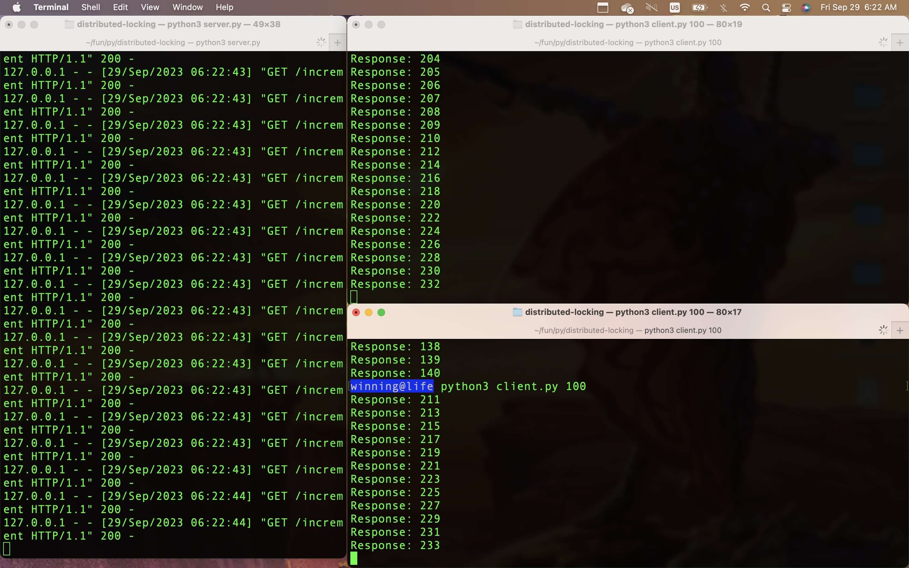

to run

start server

`
$ python3 server.py
`

open other terminals, start other clients making requests, like the ff makes 100 requests

`
$ python3 client.py 100
`

client terminals will be updated concurrently, see screenshot:

# distributed locking

it's a simple version of distributed locking, made on a quick friday morning minutes after waking up cause i got bored and curious from something i read last night. it's very simple, one central server that manages the lock, in real life it's a cluster of servers using some consensus algorithm to decide which gets lock

this simple version demos distributed locking in a simple setup of multiple client nodes accessing a shared resource which in this case is the counter that is managed by the server to ensure sequential access